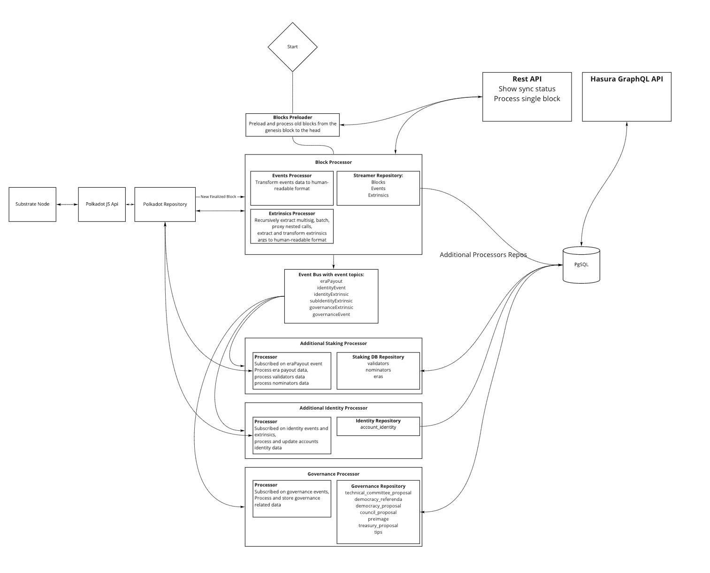

# MBELT draft

# Introduction

Multi blockchain ETL solution is an interoperability-first data warehouse with graphQL API capable to provide application-specific data, designed to reduce cost as well as simplify the process of building wallets, dashboards, explorers and apps that interact with multiple blockchains connected through an interchain communication protocol.

# Features

- Support extract and store data from Polkadot, Kusama and Parachains
- GraphQL API built with Hasura
- Docker-compose setup for easy deployment of the ETL and API solution
- Materialised views for Postgresql
- Redash with built-in dashboards

# Dependencies

- Docker
- Docker Compose
- Make (optional)
- Python

# Ram requirements

- streamer: 2Gb
- Postgresql: 1Gb

You need Polkadot or Kusama node **in archive mode** with an open websocket interface.

Docker service should be started first.

Also python need to be installed installed.

# Pre-installs

## Docker installation

```
1. Update package:
sudo apt update

2. Install package for HTTPS:

sudo apt install apt-transport-https ca-certificates curl software-properties-common
3. Add GPG-key for Docker:

curl -fsSL https://download.docker.com/linux/ubuntu/gpg | sudo apt-key add -
4. Add repository for Docker:

sudo add-apt-repository "deb [arch=amd64] https://download.docker.com/linux/ubuntu bionic stable"

5. Update package:

sudo apt update
6. Switc to Docker repository and install:

apt-cache policy docker-ce

7. Install Docker:

sudo apt install docker-ce

8. Check installation:

sudo systemctl status docker

Output info:
docker install ubuntu
Docker install Ubuntu

10. Add user to Docker group (not required):

sudo usermod -aG docker ${user}

11. Input (not required):

su - ${user}

Add user password (not required):

12. Check Docker image:

docker run hello-world

You must see «Hello from Docker!»

```

## Python installation

```
1. Update package:
sudo apt update

2. Install python:
sudo apt install python3-pip

3. Check version:
python3 -V

Output
Python 3.8.2
```

## Other packages

In additional following package also must to be installed

```
git:
sudo apt install git

docker-compose:
pip install docker-compose
```

# Quick Start

```
git clone https://github.com/p2p-org/polkadot-profit-transformer.git

cd polkadot-profit-transformer

cp docker/env/.streamer.env.example docker/env/.streamer.env
cp docker/env/.postgres.env.example docker/env/.postgres.env
cp docker/env/.redash.env.example docker/env/.redash.env
cp docker/env/.hasura.env.example docker/env/.hasura.env


make up
```

Then whole blocks sync begins.

Sync process continues for a few days (about 1M blocks/day)

# REST API

To monitor streamer status, you can use API on port, defined in ./docker/env/.streamer.env (3000 by default)

**API is protected with Basic Auth:**

user: `admin`

password: `password` as REST_API_BASIC_AUTH_PASSWORD in .streamer.env

## API methods

[http://0.0.0.0:3000/health](http://0.0.0.0:3000/health) - responses `{"status":"live"}` if healthy

[http://0.0.0.0:3000/status](http://0.0.0.0:3000/status) - responses `{"status":"preloading in progress","currentBlockId":301790}` or `"listening for finalized blocks"` if preloading finished

[http://0.0.0.0:3000/processBlock/:blockId](http://0.0.0.0:3000/status/1) - manually process blockId

After preload completed, the streamer will switch to the finalized blocks listening.

## GraphQL

Open-source Hasura edition used.

Initial Hasura metadata placed in ./hasura directory

Hasura deploed by directives placed in docker-compose.yml

Currently we use out-of-the-box settings, so you should set up limit/offset in queries. Usage without limits could lead to memory-based errors.

By default Hasura works on port `8001` (set your own port in docker-compose.yml),
and protected by password `myadminsecretkey` as HASURA_GRAPHQL_ADMIN_SECRET in .hasura.env

## Redash

During the sync and after the sync ended, you can use Redash to work with data.

Open your browser [https://localhost:5000](https://localhost:5000&), then login to Redash:

Login: admin@example.org

Password: supersecret123

## Make commands

`up` Create and run all containers

`ps` Show containers

`stop` Stop all containers

`clean` Remove force all containers

# How it works

## Project structure

```
├── db: schema to spin up postrges db
├── db-data: external docker volume for postgres data
├── docker
│   └── env: .env for docker (with examples)
├── hasura: hasura initial metadata (place migrations here)
├── main
│   └── src
│       ├── apps
│       │   ├── common
│       │   ├── debug-app: temp app for pre-fill of needed data
│       │   └── main: main application
│       ├── modules
│       │   ├── governance-processor
│       │   │   └── processors
│       │   │       ├── events
│       │   │       ├── extrinsics
│       │   │       └── utils
│       │   ├── identity-processor: processor to track account identities events
│       │   ├── staking-processor: track validators/nominators data
│       │   └── streamer: initial preloader and finalized block processor
│       └── utils
├── redash_dashboard: pre-installation data for redash
    └── queries

```

## Database structure

DB shema is desribed in ./db directory

It is used as entrypoint SQL when Postgres started by ./db/Dockerfile from ./docker-compose.yml

## Workflow

- **Streamer**
  - Preload all blocks before head and send them to the **Block Processor**
  - Listen for finalized blocks and send them to the **Block Processor**
- **Block Processor**
  - Get block data from chain
  - Extract extrinsics and send them to the
    - **Extrinsics Processor**
      - Check if extrinsic successfull
      - Recursive extract nested calls for the next extrinsic types
        - multisig
        - proxy
        - batch
      - form extrinsic model for DB
  - Extract events and send them to the
    - **Events Processor**
      - form event model for DB
  - Save block data in DB
  - Save extrinsics data in DB
  - Save events data in DB
  - Send block data to the Event Bus
- **Event Bus**
  - In-memory simple bus for additional processors subscriptions
  - Could be replaced by some EventBus/MessageBroker solutions
- **Additional Processors**
  - **Staking Processor**
  - **Identity Processor**
  - **Governance Processor**

## Mbelt structure diagram



## Additional Processors

Processors make additional data processing and enrichments.
We've created EventBus and send events with data in `./modules/streamer/block-processor.ts`

Processors subscribe to the EventBus events in the main app igniter `./apps/main/index.ts`

```ts
eventBus.register('eraPayout', stakingProcessor.addToQueue)

eventBus.register('identityEvent', identityProcessor.processEvent)
// etc
```

---

### **Staking Processor**

This processor calculates on EraPaid event next data:

- General Era payout data in `eras` table
- Validators data in `validators` table
- Nominators data in `nominators` table

### **Identity Processor**

This processor creates account record in `account_identity` table and updates account identity info, listening to the identity change events.

### **Governance Processor**

This processor listen to the governance extrinsics and events and save data to the next tables:

- `council_proposal`
- `democracy_proposal`
- `democracy_referenda`
- `technical_committee_proposal`
- `tips`
- `treasury_proposal`
- `preimage`

To reduce tables amount, we store this data slighlty denormalized, e.g. for proposals we store events such as `proposed`, `approved`, `executed` as well as `Votes` records from 'vote' extrinsics.

It is possible to extract all data from this storage by the SQL queries and/or GraphQL queries.

# How to add additional processor

To add an additional processor:

- create new tables in DB to store processed data
- add Knex models to the [models folder](./main/src/apps/common/infra/postgresql/models)
- add DB repository to the [postgres repos folder](./main/src/apps/common/infra/postgresql/)
- create processor folder in the [modules folder](./main/src/modules)
- add processor files similar to the other processors
- initialize repository and processor in [app ignitor](./main/src/apps/main/index.ts)
- add event name to the EventName enum in [EventBus](./main/src/modules/event-bus/event-bus.ts#L17)
- dispatch event with necessary data via eventBus.dispatch
  - do it in Block Processor with event or extrinsic call, selected by section/method
  - you can find existing dispatches [here](./main/src/modules/streamer/block-processor.ts#L104)
- subscribe your processor hanlders on the target events in [app ignitor](./main/src/apps/main/index.ts#L81)

**We've added [README file](./main/src/modules/identity-processor/README.md) to the [identity processor](./main/src/modules/identity-processor) with the detailed explanation of how this processor works**

# How to add new chain to the platform

Currently we added Moonbeam network to the streamer.

Due to the custom metadata we created the `moonbeam` brahcn in the repo with changed polkadot api initialization and removed staking-related queries.

In general you can spin up a new process of streamer with changed `SUBSTRATE_URI` in .env

Streamer will see if this network exists in in the `networks` table, if not - new network record will be created, and new data will be stored in the DB with the new `network_id` value.
