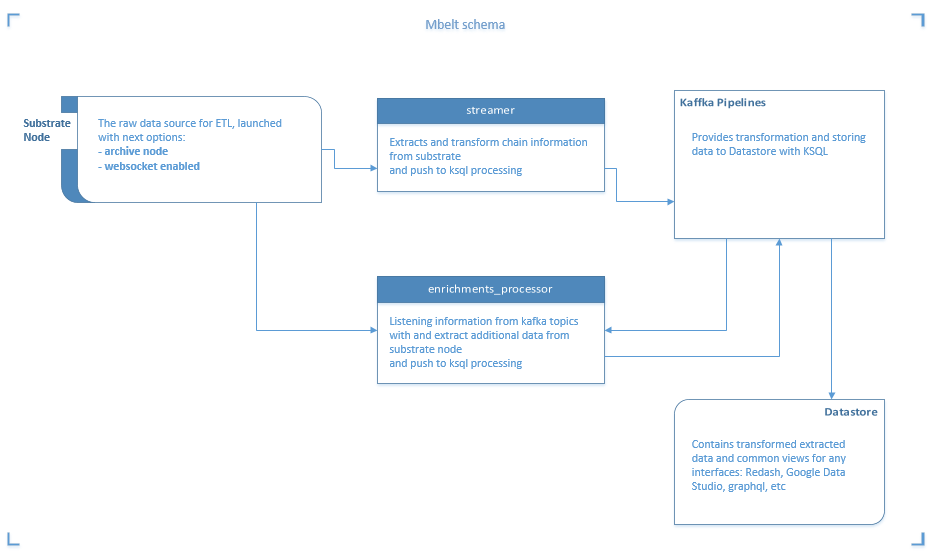

### Dependencies
* Docker (memory is allocated minimally at least 8 GB)
* Docker Compose 
* jq  
* Make _(optional)_

### System requirements
| Module | Min. RAM |
| ---- | ---- |
| **streamer** | 2Gb |
| **enrichments_processor** | 512Mb |
| KSQL cluster  | 12Gb |
| Postgresql | 1Gb |
*(for launching all stack on a single machine, required 16Gb RAM and 30Gb disk space for *polkadot*, 100Gb for *kusama*)*

You'll also need Polkadot or Kusama archive node with an open websocket interface.

### Installation

```shell
git clone https://github.com/p2p-org/polkadot-profit-transformer.git
cd polkadot-profit-transformer
# fill up SUBSTRATE_URI and APP_NETWORK in docker/env/.streamer.env, docker/env/.enrichments_processor.env
make up
```

#### Make commands

| Command | Description |
| ---- | ---- |
| `up`| Create and run all containers |
| `ps`| Show processes |
| `stop`| Stop all containers |
| `rm`|  Remove force all containers |

#### Configuring environment

**streamer** - extracts and transform chain information from substrate node (should be launched in archive mode) via websocket connection 
and push to ksql processing. Default environment configuration file *.streamer.env*.

| Command | Default | Description |
| ---- | ---- | ---- |
| `API_ADDR`| `0.0.0.0` | RPC API address  |
| `API_PORT`| `8080` | RPC API port |
| `APP_MODE`| `info` | Logger level (`debug`, `info`, `warning`, `error`) |
| `SUBSTRATE_URI`| - | Substrate url to websocket connection node, `ws://host:port` |
| `KAFKA_URI`| - | Host to kafka broker `host:port` |
| `APP_MODE`| `dev` | Suffix for application mode (`dev`, `prod`, `staging`) |
| `APP_NETWORK`| - | Must be `polkadot`, `kusama` and other |
| `DB_HOST`| `localhost` | Postgresql host |
| `DB_PORT`| `5432` | Postgresql port |
| `DB_NAME`| - | Database name |
| `DB_SCHEMA`| `public` | Database schema |
| `DB_USER`| `postgres` | Database user |
| `DB_PASSWORD`| - | User password |


**enrichments_processor** - listening extracts information from kafka topics with *ENRICHMENT* prefix and extract additional data from substrate node (should be launched in archive mode) via websocket connection
and push to ksql processing. Default environment configuration file *.enrichments_processor.env*.


| Command | Default | Description |
| ---- | ---- | ---- |
| `API_ADDR`| `0.0.0.0` | RPC API address  |
| `API_PORT`| `8079` | RPC API port |
| `APP_MODE`| `info` | Logger level (`debug`, `info`, `warning`, `error`) |
| `SUBSTRATE_URI`| - | Substrate url to websocket connection node, `ws://host:port` |
| `KAFKA_URI`| - | Host to kafka broker `host:port` |
| `APP_MODE`| `dev` | Suffix for application mode (`dev`, `prod`, `staging`) |
| `APP_NETWORK`| - | Must be `polkadot`, `kusama` and other |


Vendor environment configuration files 
*.postgres.env*   
*.graphile.env*  
*.redash.env*  

### Postgresql interface

1. Running psql command line from container
```shell
$ make psql
raw=# SELECT * FROM dot_polka.blocks LIMIT 10
```    
2. connecting to `db` container with mapped port and credentials from `docker/env/.postges.env`

## PostGraphile UI

Local Docker instance playground
http://localhost:4000/

## GraphQL endpoint

Local Docker instance
```bash
POST http://localhost:5000/graphql
```

Example:
```bash
curl --request POST 'http://localhost:4000/graphql' \
--header 'Content-Type: application/json' \
--data '{
	"query": "query { allBlocks { edges { node { id sessionId era hash  author  } } } }",
	"variables": null
}'
```

### Health checks

You can check that the streamer is working correctly by running
```bash
docker logs polkadot-profit-transformer_streamer_1
```
The logs should look like this:
```
[1611470950389] INFO	 (1 on c0c920a5bb9a): Process block "939" with hash 0xec2c0fb4f2ccc05b0ab749197db8d6d1c6de07d6e8cb2620d5c308881d1059b5
```

### Features
This framework provides extractions blocks and subscription to updates (with reorganization support) Polkadot and Kusama.  


### Overview
&nbsp; &nbsp;[@streamer](streamer) - The main service, provides extractions and consumer subscriptions operations for [ksqlDB pipelines](streamer/docs/SPECS.md)

&nbsp; &nbsp;Additional modules:
- [@run.sh](run.sh) - Bootstrap script: creates topics from [@ksql_config.json](ksql_config.json), reads ksql migration files from [@ksql](ksql) directory and run containers
- [@automation](automation) - contains tests, coverages blocks information processing with defined topics from `transformer_queries.json`
- [@db](db) - contains database simple init migrations
