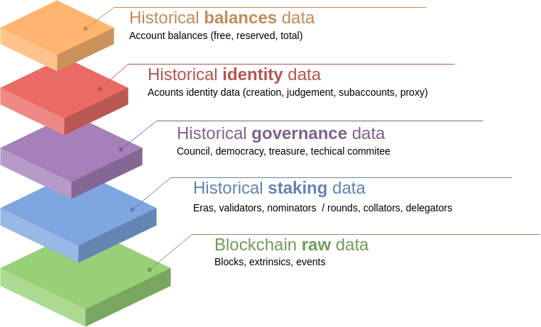
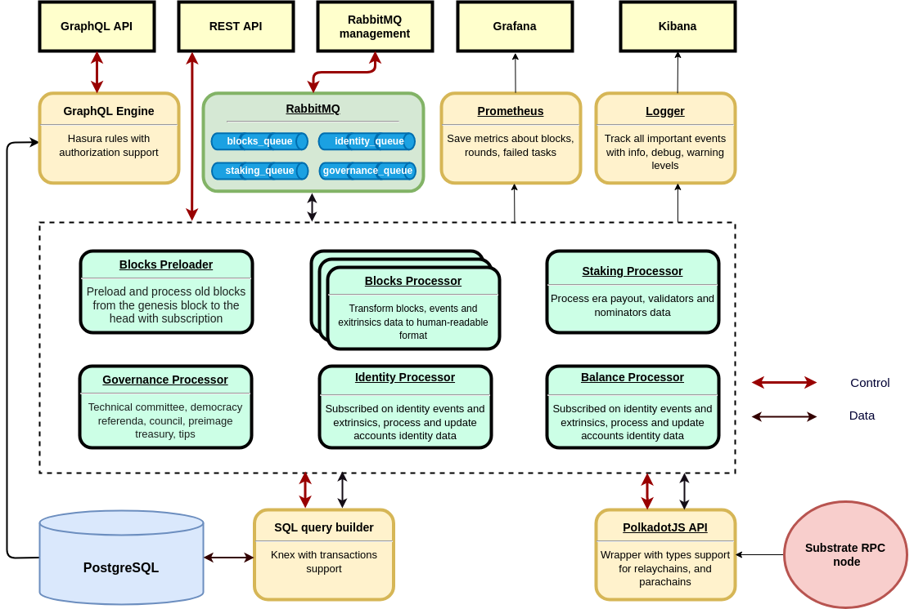

# MBELT3

# Introduction

Multi blockchain ETL solution is an interoperability-first data warehouse to provide application-specific data, designed to reduce cost as well as simplify the process of building wallets, dashboards, explorers and apps that interact with multiple blockchains connected through an interchain communication protocol.

# Features

- Support extract and store data from Polkadot, Kusama and Parachains like Moonbeam or Moonriver
- High-speed extraction (up to 50 thousands blocks per hour for 1 instance with 1CPU and 150MB RAM)
- High-scalability (100 instances can process 1 million blocks per hour).
- High-speed access to extracted data (up to 10 thousands rows per second)
- Staking and reward information for hundreds of validators and collators
- Docker-compose in-house setup in 5 seconds

# Data structure

MBELT3 provide historical data for raw data, staking, identity, balances and governance



# Dependencies

- Docker
- Docker Compose

# Ram requirements

- BlockListener: 1cpu, 200MB
- BlockProcessor: 1-100cpu, 200MB
- StakingProcessor: 1cpu, 500MB
- Postgresql: 1GB

You need RPC-node **in archive mode** with an open websocket interface.

Docker service should be started first.

# INSTALLATION 

## Docker installation

```
1. Update package:

sudo apt update

2. Install package for HTTPS:

sudo apt install apt-transport-https ca-certificates curl software-properties-common

3. Add GPG-key for Docker:

curl -fsSL https://download.docker.com/linux/ubuntu/gpg | sudo apt-key add -

4. Add repository for Docker:

sudo add-apt-repository "deb [arch=amd64] https://download.docker.com/linux/ubuntu bionic stable"

5. Update package:

sudo apt update

6. Switch to Docker repository and install:

apt-cache policy docker-ce

7. Install Docker:

sudo apt install docker-ce

8. Check installation:

sudo systemctl status docker

Output info:
docker install ubuntu
Docker install Ubuntu

9. Check Docker image:

docker run hello-world

You must see «Hello from Docker!»

10. Install docker compose

sudo apt install docker-compose 

11. Check docker-compose 

docker-compose --version

Output info:

docker-compose version 1.20.1, build 1719ceb
```

# Quick Start

```
1) Create .env file

cp main/.env.example main/.env 

2) Specify substrate URL in .env file. Like

SUBSTRATE_URI=wss://rpc.polkadot.io/

3) Start docker containers

docker-compose up -d
```

Then whole blocks sync begins.

Sync process continues for a few days (about 1M blocks/day for 1 instance of BlockProcessor)

# REST API

To monitor streamer status, you can use API on 3000 port

**API is protected with Basic Auth:**

user: `admin`

password: `password` as REST_API_BASIC_AUTH_PASSWORD in .env

## API methods

[http://0.0.0.0:3000/health](http://0.0.0.0:3000/health) - responses `{"status":"live"}` if healthy

[http://0.0.0.0:3000/metrics](http://0.0.0.0:3000/metrics) - prometheus metrics for Grafana

[http://0.0.0.0:3000/pause](http://0.0.0.0:3000/pause) - pause blocks sync

[http://0.0.0.0:3000/resume](http://0.0.0.0:3000/resume) - resume blocks sync

[http://0.0.0.0:3000/restart-unporcessed-blocks](http://0.0.0.0:3000/restart-unprocessed-blocks) - if there were some problems with blocks data extraction, then maybe you need to increase memory of the BlockProcessor and call this method for restart extraction of all unprocessed blocks

[http://0.0.0.0:3000/restart-unporcessed-eras](http://0.0.0.0:3000/restart-unprocessed-eras) - if there were some problems with staking info extraction for polkadot/kusama, then you can call this method for restart data collection for all unprocessed eras

[http://0.0.0.0:3000/restart-unporcessed-rounds](http://0.0.0.0:3000/restart-unprocessed-rounds) - if there were some problems with staking info extraction for moonbeam/moonriver, then you can call this method for restart data collection for all unprocessed rounds

[http://0.0.0.0:3000/process-block/:blockId](http://0.0.0.0:3000/status/1) - manually process blockId

After preload completed, the streamer will switch to the finalized blocks listening.

# How it works

## Project structure

```
├── db: schema to spin up postrges db
├── db-data: external docker volume for postgres data
├── docker-compose.yml: defenition of all containers (db, BlockListener, BlockProcessor, StakingProcessor, etc)
├── main
│   ├── Dockerfile.dev: common docker rules for build the container for BlockListener, BlockProcessor, StaikingProcessor, erc
│   ├── migrations: directory with files to apply db migrations 
│   └── src
│       ├── index: main application
│       ├── environment: environment defenition with default values
│       ├── loaders
│       │   ├── database: PosgreSQL initializer using knex library
│       │   ├── express: Express initializer for Rest API
│       │   ├── logger: Pino logger initializer
│       │   ├── polkadotapi: Polkadot.js wrapper initializer
│       │   ├── prometheus: Prometheus metrics initalizer for Grafana 
│       │   └── rabbitmq: RabbitMQ queue intializer
│       ├── models: database models 
│       ├── libs: auxiliary libraries
│       ├── modules
│       │   ├── index: modules initializer depends MODE (specified in the docker-compose.yml)
│       │   ├── BlockListener: initial preloader and finalized block processor
│       │   │   ├── index: module initializer
│       │   │   ├── controller: Rest API endpoints 
│       │   │   ├── service: base module logic (initial preloader and finalized block processor)
│       │   │   └── helpers
│       │   │       ├── database: methods for get/save data in db
│       │   │       └── polkadotjs: additional wrappers for polkadot
│       │   ├── BlockProcessor: extract block, events, extrinsics data
│       │   ├── PolkadotStakingProcessor: track validators/nominators and their rewards data for Polkadot/Kusama networks
│       │   ├── MoonbeamStakingProcessor: track collators/delegators and their rewards data for Moonbeam/Moonriver networks
│       │   ├── IdentityProcessor: processor to track account identities events
│       │   └── GovernanceProcessor: track governance extrinsics and events data

```

## Database structure

DB shema is desribed in ./db directory

It is used as entrypoint SQL when Postgres started by ./db/Dockerfile from ./docker-compose.yml

## Workflow

- **BlockListener**
  - Preload all blocks before head and send them to the process_block RabbitMQ queue
  - Listen for finalized blocks and send them to the process_block RabbitMQ queue
- **BlockProcessor**
  - Listen new messages in the process_block queue
  - Get block data from chain
  - Extract extrinsics and send them to the
    - **Extrinsics Processor**
      - Check if extrinsic successfull
      - Recursive extract nested calls for the next extrinsic types
        - multisig
        - proxy
        - batch
      - form extrinsic model for DB
  - Extract events and send them to the
    - **Events Processor**
      - Form event model for DB
      - Check event name and if it's like EraPayout or NewRound, then send message to the process_staking queue
  - Save block data in DB
  - Save extrinsics data in DB
  - Save events data in DB
  - Send block data to the Event Bus
  - If something fail, then rollback transaction
- **StakingProcessor**
  - Listen new messages in the process_staking queue
  - Get block metadata from chain (session_id, active era, current era, epoch)
  - Get active set of validators
  - Get list of nominators for each validator
  - Get data of stake and rewards for each validator and nominator
  - Save era data in DB
  - Save validators data in DB
  - Save nominators data in DB
  - If something fail, then rollback transaction
- **Identity Processor**
  - This processor creates account record in `account_identity` table and updates account identity info, listening to the identity change events.
- **Governance Processor**
  - This processor listen to the governance extrinsics and events and save data to the next tables:
    - `council_proposal`
    - `deemocracy_proposal`
    - `democracy_referenda`
    - `technical_committee_proposal`
    - `tips`
    - `treasury_proposal`
    - `preimage`
  - To reduce tables amount, we store this data slighlty denormalized, e.g. for proposals we store events such as `proposed`, `approved`, `executed` as well as `Votes` records from 'vote' extrinsics.


## Mbelt architecture diagram



# How to add additional processor module

To add an additional processor:

- create new tables in DB to store processed data
- add Knex models to the [models folder](./main/src/models)
- create processor folder in the [modules folder](./main/src/modules)
- add processor files similar to the other processors (index.ts, controller.ts, service.ts, helpers)
- initialize processor in [modules folder](./main/src/modulse/index.ts)
- add event name and queue in the tasks lib [tasks repository](./main/src/lib/tasks.repository.ts)
- subscribe your processor hanlders on the target queue messages in [module service](./main/src/apps/modules/new_module/index.ts)

# How to add new chain to the platform

Currently we added Moonbeam network to the streamer.

Due to the custom metadata we created the `moonbeam` brahcn in the repo with changed polkadot api initialization and removed staking-related queries.

In general you can spin up a new process of streamer with changed `SUBSTRATE_URI` in .env

Streamer will see if this network exists in in the `networks` table, if not - new network record will be created, and new data will be stored in the DB with the new `network_id` value.
