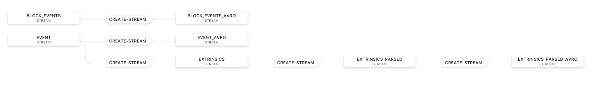
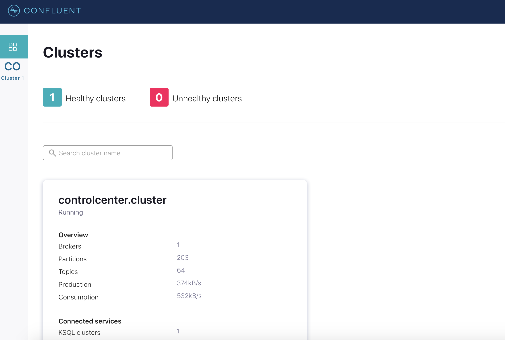
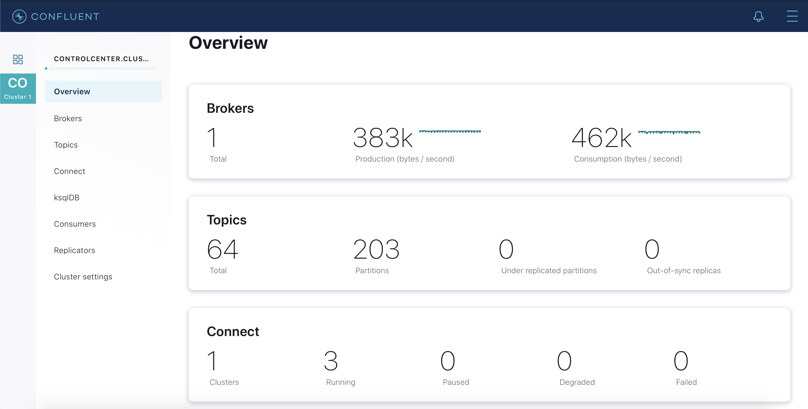
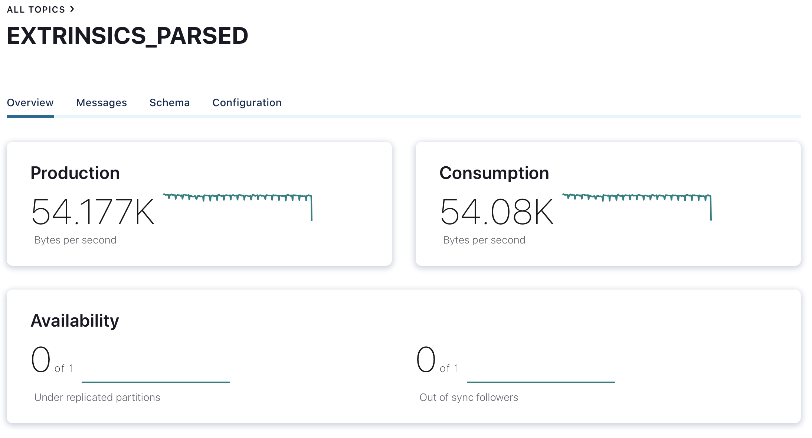
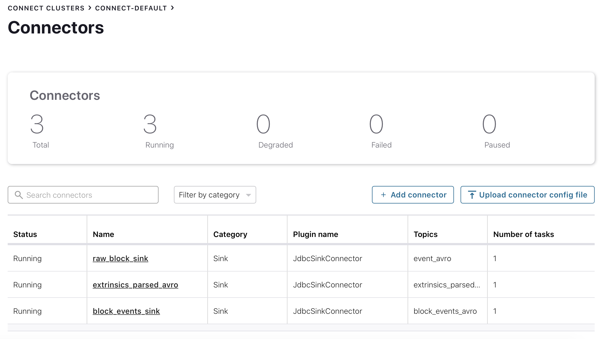
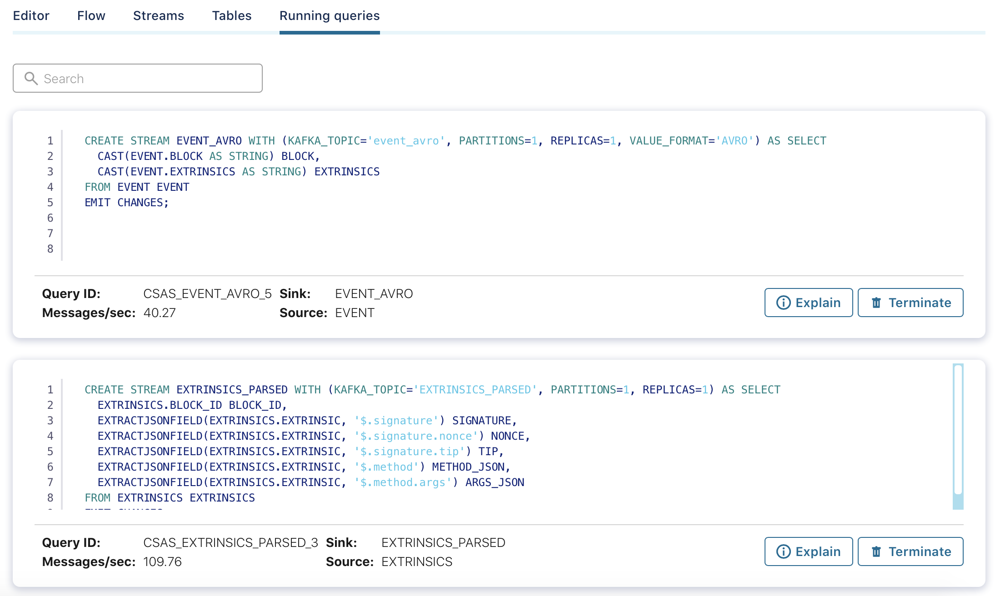

## What is happening inside KSQLDB?
Data flow:


1. Data produced by PolkadotStreamer gets into Kafka Topic **event** and further into KSQLDB stream **EVENT**;
    1. A stream called **EVENT_AVRO** collects raw data from **EVENT** with AVRO format and sends it to topic **EVENT_AVRO** to sink it to a Postgres table 'block_raw';
    2. **EXTRINSICS** - extracts block's number from raw data and explodes event.extrinsics field for further processing;
    3. **EXTRINSICS_PARSED** - extracts all fields (signature, nonce, etc) from earlier exploded field;
    4. **EXTRINSICS_PARSED_AVRO** - formats the data to AVRO, sends it to a topic **EXTRINSICS_PARSED_AVRO** to sink it to a Postgres table **extrinsics_parsed**;
2. Data produced by EventsEnrichment gets into Kafka topic **BLOCK_EVENTS** and further into KSQLDB stream **BLOCK_EVENTS**:
    1. **BLOCK_EVENTS_AVRO** formats the data to AVRO and sends it to a topic **BLOCK_EVENTS_AVRO** to sink it to a Postgres table **block_events**;

## How does data sink to a DB?

KSQLDB has a special JDBCSinkConnector.

It collects data from some Kafka topic and inserts the data to a DB table.

## Message format examples

* **EVENT** and **EVENT_AVRO** topics:
 ```
{
  block: {
    header: {
      number: 5,
      hash: '0x68a27df5a52ff2251df2cc8368f7dcefb305a13bb3d89b65c8fb070f23877f2c',
      stateRoot: '0x01045dae0c5d93a84c3dc1f0131126aa6aa1feb26d10f029166fc0c607468968',
      extrinsicsRoot: '0xa9439bbc818bd95eadb2c5349bef77ee7cc80a282fcceb9670c2c12f939211b4',
      parentHash: '0xd380bee22de487a707cbda65dd9d4e2188f736908c42cf390c8919d4f7fc547c',
      digest: '{"logs":[{"PreRuntime":[1161969986,"0x03000000009ddecc0f00000000a8a9c1d717f3904506e333d0ebbf4eed297d50ab9b7c57458b10182f1c84025ef09d3fb5b5f4cb81688939e6363f95aa8d91645fa7b8abc0a6f37812c777c307df51071082d3ff89d4e1b5ad8f5cd3711ada74292c4808237bdf2b076edb280c"]},{"Seal":[1161969986,"0xf66230eb71705213dd10256e3ca5af07492ac420128ecb8bc98f1fcd1f74986d348addbabd4813f0022835b21d720ecadce66a57480d87dfd51d77f3474cb68b"]}]}'
    }
  },
  extrinsics: [
    '{"signature":{"signer":"111111111111111111111111111111111HC1","signature":{"Ed25519":"0x00000000000000000000000000000000000000000000000000000000000000000000000000000000000000000000000000000000000000000000000000000000"},"era":{"ImmortalEra":"0x00"},"nonce":0,"tip":0},"method":{"callIndex":"0x0300","args":{"now":1590507438000}}}',
    '{"signature":{"signer":"111111111111111111111111111111111HC1","signature":{"Ed25519":"0x00000000000000000000000000000000000000000000000000000000000000000000000000000000000000000000000000000000000000000000000000000000"},"era":{"ImmortalEra":"0x00"},"nonce":0,"tip":0},"method":{"callIndex":"0x1400","args":{"heads":[]}}}'
  ]
}
```

* **EXTRINSICS_PARSED** topic:
```json
{
  "BLOCK_ID": "18713",
  "SIGNATURE": "{\"signer\":\"111111111111111111111111111111111HC1\",\"signature\":{\"Ed25519\":\"0x00000000000000000000000000000000000000000000000000000000000000000000000000000000000000000000000000000000000000000000000000000000\"},\"era\":{\"ImmortalEra\":\"0x00\"},\"nonce\":0,\"tip\":0}",
  "NONCE": "0",
  "TIP": "0",
  "METHOD_JSON": "{\"callIndex\":\"0x0a00\",\"args\":{\"hint\":18710}}",
  "ARGS_JSON": "{\"hint\":18710}"
}
```

* **BLOCK_EVENTS** AND **BLOCK_EVENTS_AVRO** topics:

```json
{
  "block_hash": "0xffc08067b55e50b3d17deab085fce15a327cd91bafa82db556c3515bc2bec2d6",
  "block_events": "[{\"phase\": 0, \"extrinsic_idx\": 0, \"type\": \"0000\", \"module_id\": \"System\", \"event_id\": \"ExtrinsicSuccess\", \"params\": [{\"type\": \"DispatchInfo\", \"value\": {\"weight\": 158000000, \"class\": \"Mandatory\", \"paysFee\": \"Yes\"}, \"valueRaw\": \"\"}], \"topics\": [], \"event_idx\": 0}, {\"phase\": 0, \"extrinsic_idx\": 1, \"type\": \"0000\", \"module_id\": \"System\", \"event_id\": \"ExtrinsicSuccess\", \"params\": [{\"type\": \"DispatchInfo\", \"value\": {\"weight\": 0, \"class\": \"Mandatory\", \"paysFee\": \"Yes\"}, \"valueRaw\": \"\"}], \"topics\": [], \"event_idx\": 1}, {\"phase\": 0, \"extrinsic_idx\": 2, \"type\": \"0000\", \"module_id\": \"System\", \"event_id\": \"ExtrinsicSuccess\", \"params\": [{\"type\": \"DispatchInfo\", \"value\": {\"weight\": 1000000000, \"class\": \"Mandatory\", \"paysFee\": \"Yes\"}, \"valueRaw\": \"\"}], \"topics\": [], \"event_idx\"}]"
}
```

Input and enrichment data are intentionally non-optimal to test and show how different edge cases are handled

## End-to-end latency of streams(topics)
* **EVENT** (intermediate stream) - 3ms
* **EVENT_AVRO** (raw block's data sinking to Postgres) - 63ms
* **BLOCK_EVENTS** (intermediate stream) - 4.5ms
* **BLOCK_EVENTS_AVRO** (sink to Postgres) - 63ms
* **EXTRINSICS** (intermediate stream to process data) - 62ms
* **EXTRINSICS_PARSED** (intermediate stream to process data) - 160ms
* **EXTRINSICS_PARSED_AVRO** (parsed extrinsic's data sinking to Postgres) - 260ms

## How to see PoC?

Navigate to the Control Center web interface at http://localhost:9021/ and select your cluster.


You'll see an overview of the cluster and some tabs:


* **Topics** tab contains all topics created by the script and streams. Click by a topic and you see a full statistic about it.


* **Connect** tab contains an info about all connectors in the system.


* **ksqlDB** tab provides an interface for working with queries, streams and tables

    * Sub-tab **Running queries** provides information about running queries in the system.
    
